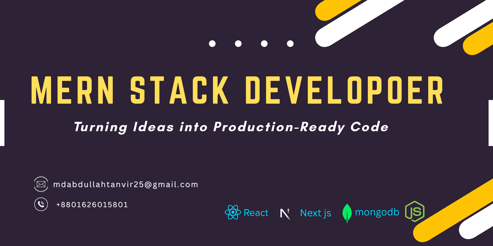

  

## Hi there 👋, Md Abdullah Al Tanvir
### MERN Stack Developer

I’m a Frontend-focused MERN Stack Developer with hands-on experience in React.js, Next.js, Node.js, Express.js, and MongoDB. I build modern, scalable, and user-focused web applications, turning ideas into functional and interactive products. I want to express my innovative, creative skills for company growth through the assigned responsibility.

---

## 🔭 Current Activities
- I’m currently working on an **e-commerce website**
- I’m exploring **Next.js**

---

## 🛠 Skills

### Frontend

  
  
  
  
  

### Backend

  
  
  

---

## 📫 Connect with me

  
  
  
  

---

## 📊 GitHub Stats

  

  

